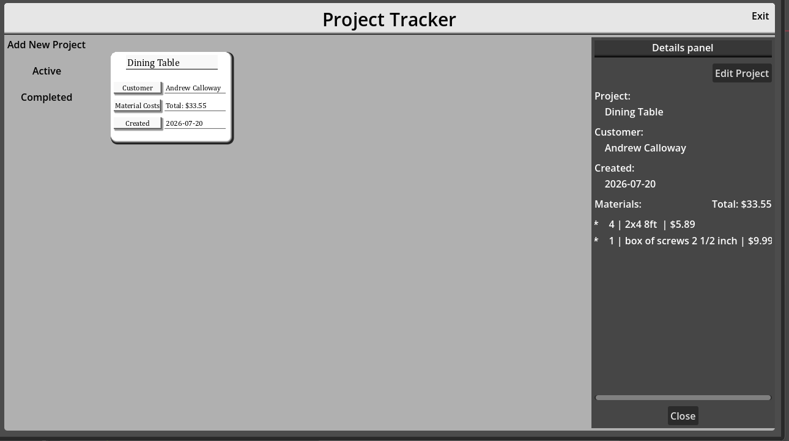
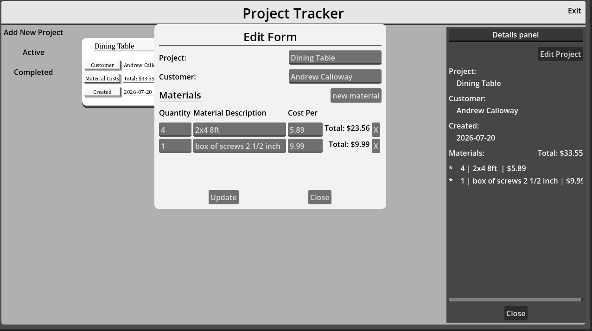
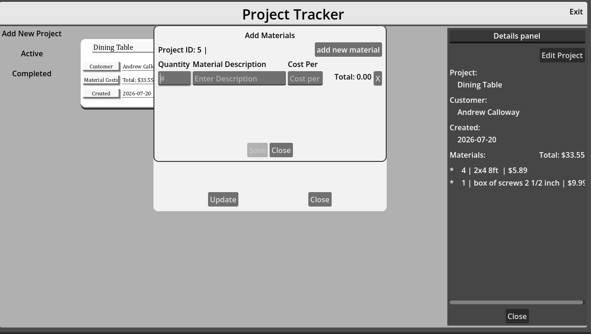

# Woodshop Project Tracker

A desktop application for organizing woodworking projects, customers, materials, and project costs. I built this project in Godot to practice application development, user-interface design, relational databases, and persistent data storage.

## Features

- Create and edit woodworking projects
- Store a customer name for each project
- Add, update, and remove project materials
- Track material quantities and prices
- Calculate the total material cost for each project
- Mark projects as completed
- Switch between active and completed project views
- Save project data between sessions using SQLite
- Delete a project and its related material records

## Screenshots

  

## Technologies

- **Godot Engine 4.6**
- **GDScript**
- **SQLite**
- **Godot SQLite plugin 4.7**
- **Git and GitHub**

## Technical Overview

The application uses two related SQLite tables:

- `projects` stores the project name, customer, creation date, completion date, and completion status.
- `materials` stores the material description, quantity, price, and the related project ID.

The `project_id` field creates a one-to-many relationship between projects and their materials. The application uses parameterized SQL queries to create, read, update, and delete records. Project totals are calculated from each material's quantity and price.

The SQLite database is created automatically in Godot's `user://` data directory when the application starts.

## Project Structure

The Godot project is inside the [`woodshoptracker`](woodshoptracker) folder.

- `Scenes/` contains the application screens and reusable interface components.
- `Scripts/` contains the GDScript application and database logic.
- `addons/godot-sqlite/` contains the SQLite integration used by the project.
- `project.godot` is the Godot project file.

## Running the Project

1. Clone or download this repository.
2. Install [Godot Engine 4.6](https://godotengine.org/).
3. In Godot's Project Manager, select **Import**.
4. Choose `woodshoptracker/project.godot`.
5. Open the project and press **F6** or the Run Project button.

No separate database setup is required.

## What I Practiced

This project helped me practice:

- Designing a workflow-focused desktop application
- Creating data-entry and editing forms
- Using Godot signals to communicate between scenes
- Building reusable interface components
- Working with relational tables and foreign keys
- Writing parameterized SQL queries
- Validating user input
- Testing and debugging application behavior
- Researching unfamiliar syntax and implementing solutions independently

## Project Status

The core project-management, material-tracking, cost-calculation, and completion workflows are functional. This is an ongoing learning and portfolio project, and the interface and documentation may continue to improve.
